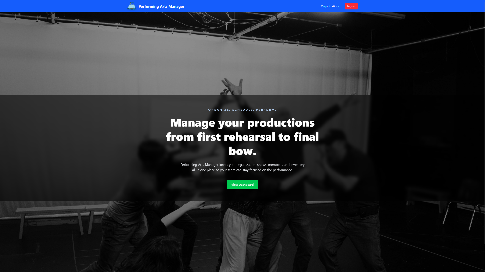
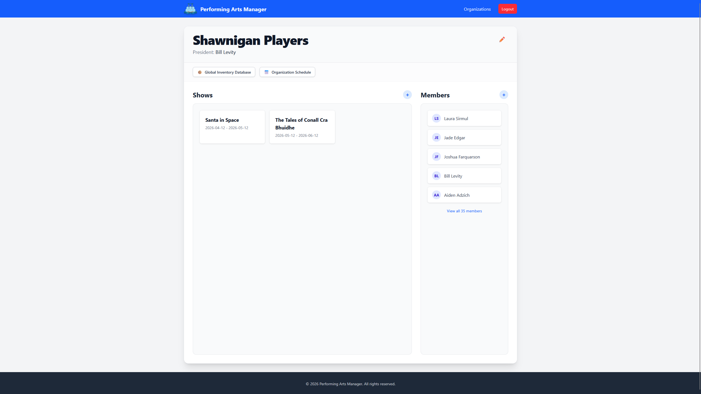
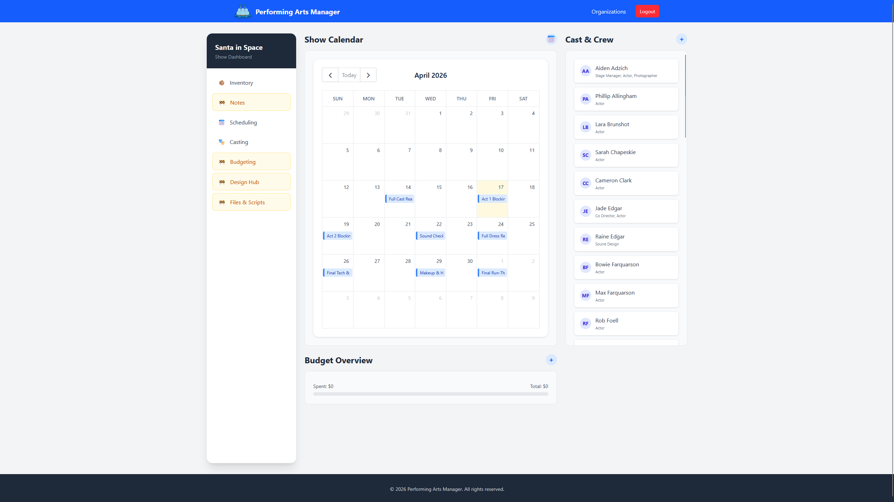
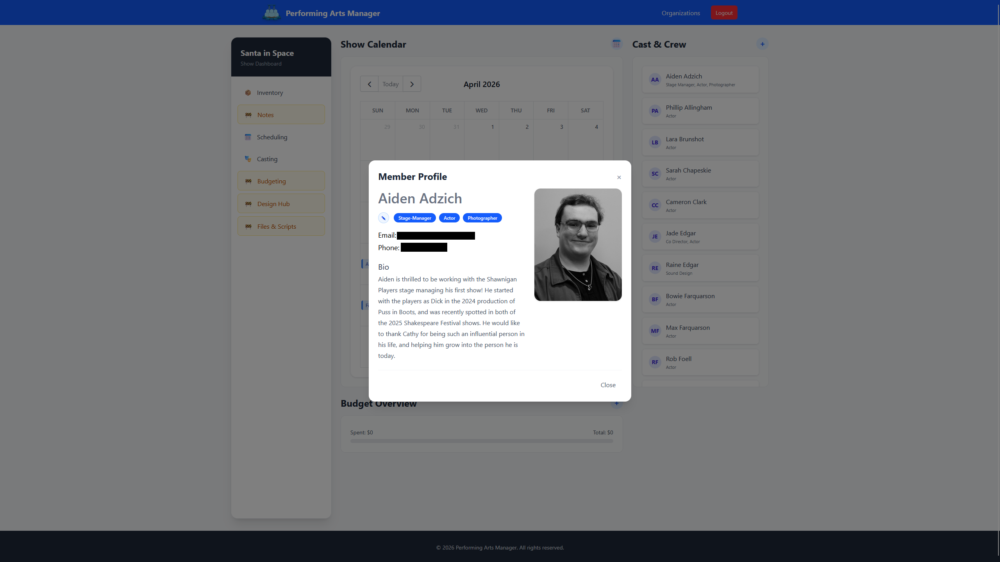

# Performing Arts Manager

Performing Arts Manager is a full-stack web application for managing theatre and performance productions. It helps organize shows, cast members, rehearsals, inventory, organizations, and role assignments in one place.

The app is designed for desktop browsers and is built around a React frontend and an Express/MySQL backend.

## Features

- User authentication with JWT
- Organization and membership management
- Show management and cast/crew assignments
- Rehearsal scheduling
- Inventory tracking for props, costumes, sets, lighting, and more
- Upload and serve media files for profiles and inventory items
- Admin utilities and reset workflows

## Screenshots

### Home Dashboard

[](documentation/screenshots/home.png)

### Organization View

[](documentation/screenshots/organization.png)

### Show View

[](documentation/screenshots/show.png)

### User Profile

[](documentation/screenshots/user.png)

## Branch
This branch is a frozen copy of sprint2 being used for ITAS276 Assignment 02

## Tech Stack

- **Frontend:** React, Vite, React Router, Axios, Tailwind CSS, FullCalendar
- **Backend:** Node.js, Express, Sequelize, JWT, Multer
- **Database:** MySQL
- **Testing:** Vitest, Supertest

## Repository Structure

```text
client/   # React web app
server/   # Express API, models, routes, tests, and seed scripts
docker-compose.yml
README.md
```

### Main backend areas

- `auth` - login and authentication
- `users` - user/profile data
- `organizations` - organization membership and roles
- `shows` - show data, cast, and roles
- `schedule` - rehearsals and events
- `inventory` - production inventory and attachments
- `admin` - administrative actions

## Prerequisites

- Node.js and npm
- MySQL server
- Optional: Docker and Docker Compose

## Environment Variables

### Backend

The server reads environment variables through `dotenv`.

| Variable | Default | Purpose |
| --- | --- | --- |
| `API_PORT` | `5000` | Port the Express server listens on |
| `DB_USER` | `root` | MySQL username |
| `DB_PASSWORD` | `` | MySQL password |
| `DB_NAME` | `performing-arts-manager-db` | Database name |
| `DB_HOST` | `127.0.0.1` | MySQL host |
| `DB_PORT` | `3306` | MySQL port |
| `DB_DIALECT` | `mysql` | Sequelize dialect |
| `DB_SSL` | `false` | Enable SSL for the database connection |

### Frontend

| Variable | Default | Purpose |
| --- | --- | --- |
| `VITE_BACKEND_URL` | `http://localhost:8050` | Base URL used by the React app to reach the API |

> **Note:** The frontend default points to port `8050`, while the local server default is `5000`. When running locally, set `VITE_BACKEND_URL` to match your backend URL.

## Local Development Setup

### 0) Clone the repo
```powershell
git clone https://github.com/Mindstormman06/performing-arts-manager.git
```

### 1) Install dependencies

Run these commands from the repository root:

```powershell
cd client
npm install

cd ..\server
npm install
```

### 2) Configure the backend

Create a `.env` file for the backend and set the database credentials and server port.

Example:

```env
API_PORT=5000
DB_USER=root
DB_PASSWORD=your_password
DB_NAME=performing-arts-manager-db
DB_HOST=127.0.0.1
DB_PORT=3306
DB_DIALECT=mysql
DB_SSL=false
```

### 3) Configure the frontend

Create a `client/.env` file if you want to override the API URL during local development:

```env
VITE_BACKEND_URL=http://localhost:5000
```

### 4) Start the backend

```powershell
cd server
npm run dev
```

The API will be available at the configured `API_PORT` and exposes a health check at:

```text
http://localhost:5000/server-up
```

### 5) Start the frontend

```powershell
cd client
npm run dev
```

By default, Vite serves the app on:

```text
http://localhost:5173
```

## Docker Setup

To run the app with Docker Compose:

```powershell
docker compose up --build
```

The compose file maps:

- Backend: `http://localhost:15006`
- Frontend: `http://localhost:15007`

Uploads are persisted in a Docker volume named `server_uploads`.

## Available Scripts

### Client (`client/`)

```powershell
npm run dev      # Start Vite dev server
npm run build    # Build the frontend for production
npm run lint     # Run ESLint
npm run preview  # Preview the production build
npm run biome    # Run Biome checks
npm run biome-fix # Run Biome checks and auto-fix safe issues
```

### Server (`server/`)

```powershell
npm run dev            # Start the API with nodemon
npm test               # Run Vitest test suite
npm run coverage       # Run tests with coverage output
npm run seed           # Reset and seed the database with demo data
npm run biome          # Run Biome checks
npm run biome-fix      # Run Biome checks and auto-fix safe issues
npm run biome-fix-unsafe # Run Biome checks with unsafe fixes
npm run retire         # Scan dependencies for known insecure packages
```

## Seeding Data

The server includes a seed script that wipes and recreates the database, then loads sample organizations, users, shows, schedules, inventory, and casting data.

Use it only when you are sure you want to reset the database:

```powershell
cd server
npm run seed
```

## Testing

The backend includes automated tests under `server/tests/`.

```powershell
cd server
npm test
```

For coverage:

```powershell
npm run coverage
```

## Notes

- The backend serves uploaded files from `/uploads`.
- The server health check route is `/server-up`.
- If you change the backend port, update `VITE_BACKEND_URL` accordingly.

## License

This project is licensed under the MIT License. See the `LICENSE` file for details.
